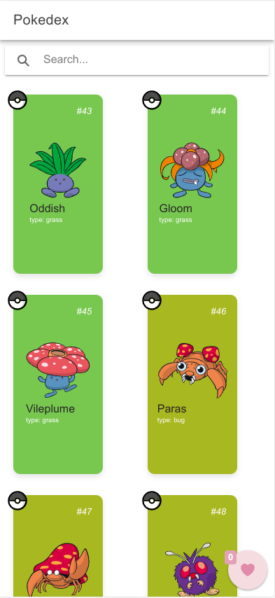
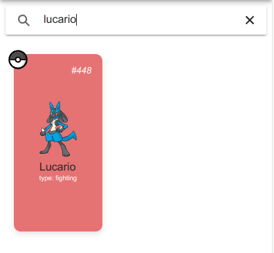
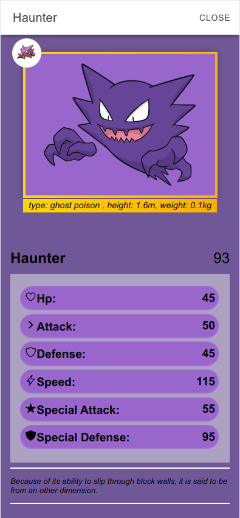
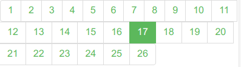
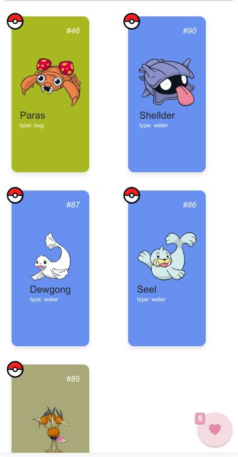
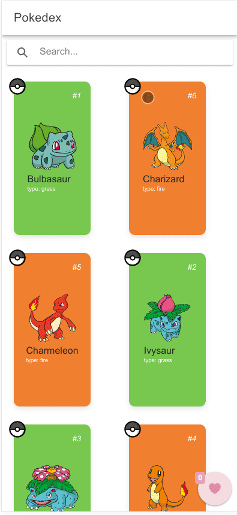

# Pokedex Ionic/Angular

## Getting Started

These instructions will guide you in setting up the project on your local machine for development and testing purposes.

## Prerequisites

Ensure that you have the following software installed on your machine:

```
1. node.js version >= 20.8.1
2. npm version >= 10.2.1
3. Ionic >= 7.1.1
```
```
Angular CLI: 16.2.6
Node: 20.8.1 (Unsupported)
Package Manager: npm 10.2.1
OS: linux x64

Angular: 16.2.9
... animations, common, compiler, compiler-cli, core, forms
... language-service, platform-browser, platform-browser-dynamic
... router

Package                         Version
---------------------------------------------------------
@angular-devkit/architect       0.1602.6
@angular-devkit/build-angular   16.2.6
@angular-devkit/core            16.2.6
@angular-devkit/schematics      16.2.6
@angular/cli                    16.2.6
@schematics/angular             16.2.6
rxjs                            7.8.1
typescript                      5.0.4
zone.js                         0.13.3
```

## Built With

-[Ionic/Angular](https://ionicframework.com/docs/angular/overview)

## Objective

Build an ionic/angular application that request from [PokeApi](https://pokeapi.co/) information to build a pokedex, this application feat a search mechanism, a modal with selected pokemon information and you can favorite your pokemon, for default it will fetch only the first 151 pokemons but you can search for any pokemon in the search bar.

## Approaching

I've separated the project into four parts services, pokedex(main), components and mock data. Also i've used dto folder to create interface of types that i would use in this project, in service i've focused on create a minimal structure an leave the pokedex to deal with the data, speaking of which the pokedex is divided in two classes the utils that do all requests and construct the pokemons data and its subclass which is more responsible to create logic that is used in the main page, the components are used to create the pokemon card, modal, pagination and a missing page if there is no pokemon found in search. The unit test was focuses more in the response of the services to assure that the data the we are fetching is coming correctly from the API.

## Features

### Main Page


### Search Mechanism


### Modal


### Pagination


### Favorite Button


### Favorite Area


## Final Project



## Project Structure
```
pokedex-ionic-angular/
|-- src/
|   |-- app/
|       |-- components/
|       |   |-- pokemon-card/
|       |   |   |-- pokemon-card.component.ts
|       |   |   |-- pokemon-card.component.html
|       |   |   |-- pokemon-card.component.scss
|       |
|       |   |-- modal/
|       |   |   |-- modal.component.ts
|       |   |   |-- modal.component.html
|       |   |   |-- modal.component.scss
|       |
|       |   |-- paginator/
|       |   |   |-- paginator.component.ts
|       |   |   |-- paginator.component.html
|       |   |   |-- paginator.component.scss
|       |   |
|       |   |-- missing-page/
|       |       |-- missing-page.component.ts
|       |       |-- missing-page.component.html
|       |       |-- missing-page.component.scss
|       |
|       |-- dto/
|       |    |-pokemon-listar-resumo.dtos.ts
|       |    |-pokemon-listar.dtos.ts
|       |    |pokemon.dto.ts
|       |
|       |-- mocks
|       |    |--mock-fetch-pokemon-data.ts
|       |    |--mock-list-pokemons.ts
|       |    |--mock-pokemon-modal.ts
|       |    |--mock-search-pokemon-description.ts
|       |    |--mock-search-pokemon.ts
|       |
|       |-- services/
|       |   |-- pokeapi.service.spec.ts
|       |   |-- pokeapi.service.ts
|       |
|       |-- pokedex/
|       |    |-- _utils
|       |    |   |-- fetch-pokemon
|       |    |       |-- fetch-pokemon.component.ts
|       |    |
|       |    |-- pokedex-routing.module.ts
|       |    |-- pokedex.html
|       |    |-- pokedex.module.ts
|       |    |-- pokedex.scss
|       |    |-- pokedex.spec.ts
|       |    |-- pokedex.ts
|       .
|       .
|       .
|
|-- assets/
|   |-- presentation/
|       |-- pokedex-1.png
|       |-- search-bar.png
|       |-- haunter-modal.png
|       |-- pagination.png
|       |-- favorite-fav-icon.png
|       |-- favorite-area.png
|       |-- pokedex-presentation.gif
|
|
|-- LICENSE.md
|-- README.md
|-- package.json
|-- tsconfig.json
.
.
.
```

## Authors

- **Juliano Pedraça** - [JulianoP](https://github.com/julianopedraca)

## License

This project is licensed under the AllRights-Attribution-NonCommercial-NoDerivatives 4.1 International License - see the [LICENSE.md](LICENSE.md) file for details

# pokedex-ionic-angular
